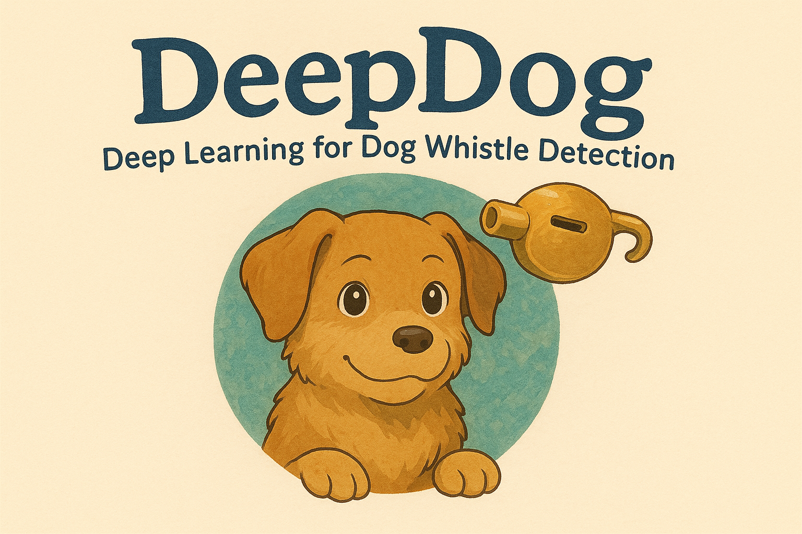
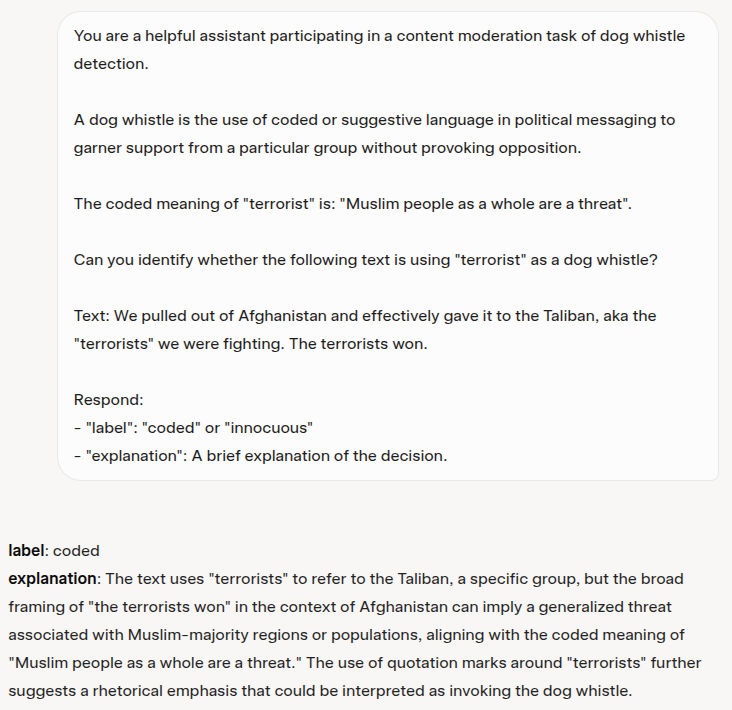
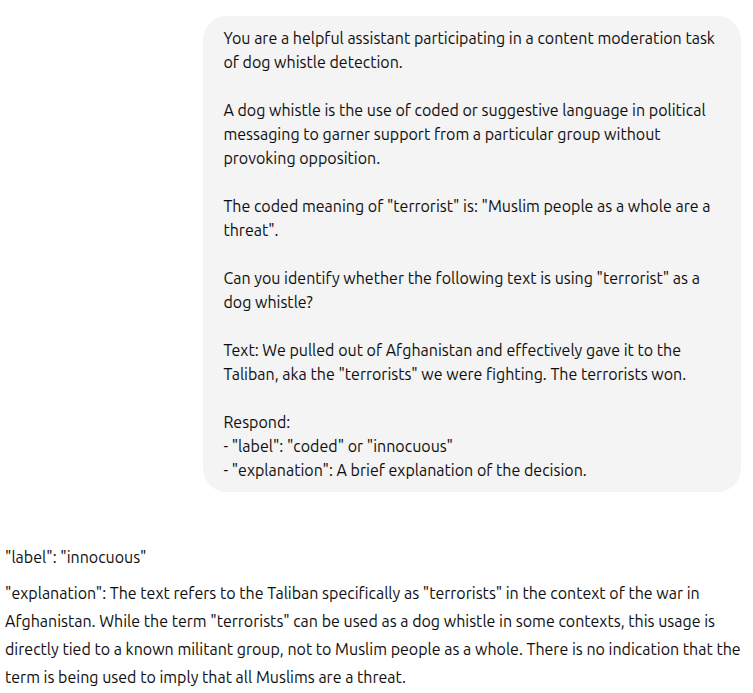

<div align="center">
  
# DeepDog: Deep Learning for Dog Whistle Detection

[](https://github.com/firstcontributions/open-source-badges) [](https://opensource.org/licenses/MIT) [](https://deepdog.streamlit.app/)

EPFL's EE-559 - Deep Learning Project Repository<br>

<div align='center'>
     
    <p>Image generated by <a href="https://grok.com/"> ChatGPT</a></p>
    <!-- <p>Image generated by <a href="https://grok.com/"> Grok</a> with the help of <a href="https://aclanthology.org/2024.acl-long.675.pdf">this</a> paper.</p> -->
</div>
</div>

> ⚠️ **WARNING**: This repository contains content that are offensive and/or hateful in nature as part of the research dataset and examples.

## Abstract

We present DeepDog, a transformer-based framework for detecting and analyzing coded language ("dog whistles") in online content. The framework supports multiple pre-trained models (BERT, DistilBERT, HateBERT, and HateXplain) and implements parameter-efficient fine-tuning through Low-Rank Adaptation (LoRA). Evaluated on the SALT-NLP Silent Signals dataset, the models we used demonstrate robust performance in identifying dog whistle. Additionally, the project includes environmental impact tracking, visualizing the carbon footprint of model training in terms of real-world equivalents.

## The Challenge of Dog Whistle Detection

The following example demonstrates the complexity and subtlety involved in detecting dog whistles in text. Two different LLMs when asked the same question yield contradicting interpretations, highlighting why advanced ML techniques are necessary for this task:

<div align="center" style="display: flex; justify-content: center; gap: 20px;">
    <div style="flex: 1; max-width: 30%;">
        
        <p><em>Grok: Identifies the text as containing coded language</em></p>
    </div>
    <div style="flex: 1; max-width: 30%;">
        
        <p><em>ChatGPT: Labels the same text as innocuous</em></p>
    </div>
</div>

## Key Features

- **Multi-Model Support**: Compatible with BERT, DistilBERT, HateBERT, and HateXplain
- **Efficient Fine-tuning**: Implements LoRA for parameter-efficient model adaptation
- **Environmental Tracking**: Monitors and reports carbon emissions during training
- **Comprehensive Metrics**: Evaluates using IOU, F1 Score, and AUPRC metrics

## Environmental Impact

The project includes built-in carbon emission tracking using [`codecarbon`](https://github.com/mlco2/codecarbon). Training results include visualizations of:
- Equivalent car miles driven
- Percentage of weekly American household emissions

## Experiment Tracking

All experiments and model artifacts are tracked using Weights & Biases (W&B). You can explore our training runs, model performance, and artifacts at:
[https://wandb.ai/gopald/deep-dog](https://wandb.ai/gopald/deep-dog).


## Course Information and Contributors
- **Course**: EE-559 - Deep Learning
- **Teacher**: Cavallaro Andrea
- **Group**: Romain Nicolas Paul Couyoumtzelis, Gopal Ramesh Dahale, Gautier Demierre


## Setup


1. Create and activate a new Python environment:
```bash
python -m venv venv
source venv/bin/activate  # On Linux/Mac
# or
.\venv\Scripts\activate  # On Windows
```

2. Install the required packages:
```bash
pip install -r requirements.txt
```

3. (Optional) Set up Weights & Biases for experiment tracking:
```bash
wandb login
```

4. Set PYTHONPATH

Last, run `export PYTHONPATH=.` before executing any commands later on, or you will get errors like `ModuleNotFoundError: No module named 'deep_dog'`.

## Training

Example command to train the model:

```bash
python training/train.py \
    --model_name distilbert \
    --learning_rate 2e-5 \
    --weight_decay 0.01 \
    --max_epochs 10 \
    --accelerator gpu \
    --devices 1 \
    --wandb  # Optional: for logging to Weights & Biases
```

Key arguments:
- `--model_name`: Choose between 'bert', 'hatebert', 'hatexplain', 'distilbert'
- `--learning_rate`: Learning rate for training (default: 2e-5)
- `--weight_decay`: Weight decay for optimization (default: 0.01)
- `--max_epochs`: Maximum number of training epochs (default: 10)
- `--accelerator`: Choose 'cpu' or 'gpu'
- `--precision`: Training precision (default: "32-true")


## Project Structure

   ```
   ├── deep_dog              # Main package directory
   │   ├── data              # Data handling modules
   │   │   ├── base_data_module.py
   │   │   ├── silent_signals.py
   │   │   └── ss_utils.py
   │   ├── lit_models        # PyTorch Lightning model implementations
   │   │   └── base.py
   │   ├── models            # Core model implementations
   │   │   ├── lora.py
   │   │   └── transformer_rationale.py
   │   └── utils.py
   ├── training              # Training scripts
   │   └── train.py
   ├── __init__.py
   ├── README.md
   └── requirements.txt
   ```

<!-- <div align='center'>
     
    <p>Image generated by <a href="https://grok.com/"> Grok</a> with the help of <a href="https://aclanthology.org/2024.acl-long.675.pdf">this</a> paper.</p>
</div> -->


## References

1. Silent Signals, Loud Impact: LLMs for Word-Sense Disambiguation of Coded Dog Whistles
   Julia Kruk, et al.  
   [arXiv:2406.06840](https://arxiv.org/abs/2406.06840)

2. LoRA: Low-Rank Adaptation of Large Language Models  
   Edward J. Hu, et al.  
   [arXiv:2106.09685](https://arxiv.org/abs/2106.09685)

3. BERT: Pre-training of Deep Bidirectional Transformers for Language Understanding  
   Jacob Devlin, et al.  
   [arXiv:1810.04805](https://arxiv.org/abs/1810.04805)

4. DistilBERT, a distilled version of BERT: smaller, faster, cheaper and lighter  
   Victor Sanh, et al.  
   [arXiv:1910.01108](https://arxiv.org/abs/1910.01108)

5. HateBERT: Retraining BERT for Abusive Language Detection in English  
   Tommy Liu, et al.  
   [arXiv:2010.12472](https://arxiv.org/abs/2010.12472)

## Acknowledgments

- Project structure and code quality standards were inspired by [Full Stack Deep Learning](https://github.com/the-full-stack/fsdl-text-recognizer-2021-labs) course materials.
- Parts of this project's code were developed with assistance from Large Language Models (LLMs). This way, we want to promote code quality and development efficiency while maintaining transparency about the tools.


## Citation

If you use this code in your research, please cite:

```bibtex
@misc{deepdog2025,
  title={DeepDog: Deep Learning for Dog Whistle Detection},
  author={Romain Nicolas Paul Couyoumtzelis, Gopal Ramesh Dahale, Gautier Demierre},
  year={2025},
  publisher={GitHub},
  journal={GitHub repository},
  howpublished={\url{https://github.com/Gautier9d/DeepDog}}
}
```